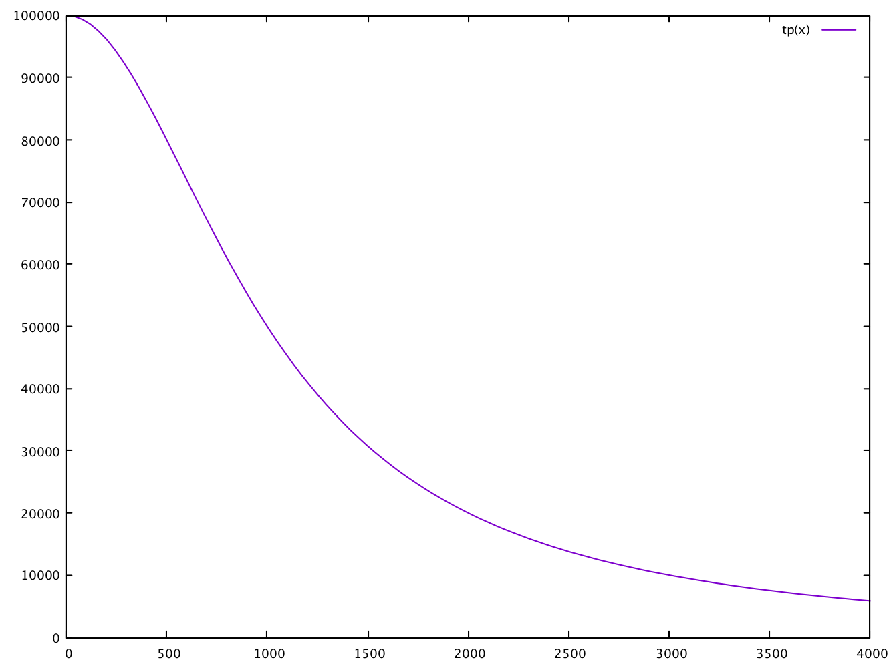

Guardnode functionality
=========================

Proposed design for Guardnode functionality in the Ocean client.

Requests
^^^^^^^^

Requests in the guardnode system must be permissioned (i.e. only authorised partners - client chains - can issue requests). Permission tokens are required to issue requests.
This works as follows:
Permission tokens (\ ``permissionAsset``\ ) are (optionally) issued to a given address in the genesis block, e.g.:

::

        permissionassetcoins=5000000
        permissioncoinsdestination=g4e638a7cc43.... # the scriptPubKey of the permissionasset output

This scriptPubKey (multisig or P2PKH) is owned by the 'controller'. The controller sends a quantity of the permissionAsset to a client chain so they can submit requests.

Requests are generated by (or on behalf of) a client (leaf) chain. The request transactions are identified by having a time (blockheight) locked (\ ``OP_CLTV``\ ) permissionAsset output paying to a 1-of-3 multisig output encoded with metadata. The 3 multisig pubkeys are as follows:

::

        key1 -> target pubkey permission asset is locked at

        key2 -> <02 pubkey prefix> <32 bytes client chain genesis block hash>

        key3 -> <03 pubkey prefix>
                <4 bytes service period start time (block height)>
                <4 bytes target number of tickets>
                <4 bytes auction price decay constant>
                <4 bytes fee percentage>
                <15 bytes empty>

The request transaction is generated with the ``createrawrequesttx`` RPC, which takes the following arguments:

1. Txid of input transaction
2. Vout (output index number) of input
3. Target request public key to lock funds into
4. Auction decay constant
5. End time of service period
6. Percentage of fees rewarded to guardnodes
7. Client chain genesis block hash
8. Start time of service period
9. Number of tickets in auction
10. Value of input transaction

The RPC will then create a new transaction with one input (txid and vout given) and two outputs. The first output will pay to the target request public key address and have a time-lock set to the end time (block height). Request outputs are in CBT, or the domain asset of the service chain if not in the Commerce Block network. The first output script can be constructed as:

.. code-block:: json

        script = CScript() ToByteVector(endBlockHeight) << OP_CHECKLOCKTIMEVERIFY << OP_DROP << OP_DUP
        << OP_1 << ToByteVector(key1) << ToByteVector(key2) << ToByteVector(key3) << OP_3 << OP_CHECKMULTISIG

The raw transaction generated by this RPC will then be signed with the private key of the (\ ``permissionAsset``\ ) input and broadcast.

Active requests RPC
^^^^^^^^^^^^^^^^^^^

To view all active requests (i.e. requests that have been confirmed but not expired: ``blockheight < endBlockHeight``\ ) the ``getrequests`` RPC is used. This RPC scans the current UTXO set for request transactions (using the permission asset type) and returns details as a JSON array.

This array contains an object for each active request. Each object contains the request metadata and the blockheight at which it was confirmed. Filtering by genesisBlock can be done by providing a block hash as the first argument.

e.g.

.. code-block:: json

   [
       {
           "startBlockHeight": 40060,
           "endBlockHeight": 90000,
           "confirmedBlockHeight": 30000,
           "genesisBlock": "fa1c7d059dab70cddb8cb3cc7b8971d385eecea4d68bd86c5cb6d75949789ba1",
           "numTickets": 100,
           "startPrice": 100000,
           "auctionPrice": 80000,
           "decayConst": 1000000,
           "feePercentage": 100,
           "txid": "cc1c7d059dab70cddb8cb3cc7b8971d385eecea4d68bd86c5cb6d75949789ba1"
       }
   ]

This RPC will be called by the Guardnode operators/interface to get current requests. If ``blockheight`` < ``startBlockHeight`` then the auction is potentially still active, to return only requests that are in auction the second argument is set to ``true``.  (This RPC can be modelled on existing functions like ``gettxoutsetinfo``\ ).

Decay function
^^^^^^^^^^^^^^

The decay function will return the current ticket bid price (in CBT sats) for given parameters, as follows:

.. code-block:: c++

   CAmount CRequest::GetAuctionPrice(uint32_t height)
   {
        uint32_t t = height - nConfirmedBlockHeight;
        if(t < 0) return 0; // auction not started yet
        return nStartPrice*(1 + t)/(1 + t + pow(t,3)/nDecayConst);
   }

Given the parameters in the object above, the ticket price is shown in the figure as function of t over 4000 blocks (~ 3 days at 1min per block).

Ticket price decay function with startPrice = 100000 CBT and decayConst = 1000000.

Request/bid table
^^^^^^^^^^^^^^^^^

An in-memory table (\ ``rtable``\ ) will list all current requests (if the node is configured with a ``-requestlist=1`` flag). The table will be updated at each new block: new requests will be added as a block is recieved (in the ``ConnectBlock`` function) and removed when ``blockheight`` > ``endBlockHeight``\ ) e.g. with a function ``UpdateRequestList``. In the event of a node re-start, the ``rtable`` will be regenerated by scanning the UTXO set with e.g. a function ``LoadRequestList``. (This can be based on the ``UpdateFreezeList`` and ``LoadFreezeList`` functions). Each entry in the table will have all the request transaction parameters and the request transaction ``txid``.

In addition, each request in the table will have a vector of valid bid transactions that have been received against the request. As valid bids are received, the transaction IDs are added to this vector (along with the bid block height) up to a max of ``numTickets``. A valid bid is decsribed below, and are added to the vector by the ``UpdateRequestList`` function.

So the table will look like this:

.. code-block:: json

   [
       {
           "requestTxID": "0a22fe0103a2f583f37d3feb94df941a6c90d8d0c3113548e0776f3413f33346",
           "confirmedBlockHeight": 30000,
           "startBlockHeight": 40060,
           "endBlockHeight": 90000,
           "genesisBlock": "fa1c7d059dab70cddb8cb3cc7b8971d385eecea4d68bd86c5cb6d75949789ba1",
           "numTickets": 100,
           "startPrice": 100000,
           "auctionPrice": 80000,
           "decayConst": 1000000,
           "feePercentage": 100,

           "bids": [
               { "txid": "65eacf082247aaf0b1624539a0d7e3bb667b73211269907b0504a3b8f8ab0a22",
                "feePubKey": "0300adf7a8f55f92f8be6a5ed7619d1821c5bc9901f5592badea04677043b83656" },
               { "txid": "af3d49ff538a9a2bcd78b924aa27f102fb391811c387e7b5b06fc034d56cd4d8",
                "feePubKey": "0311adf7a8f55f92f8be6a5ed7619d1821c5bc9901f5592badea04677043b83656" },
               { "txid": "64c787adf54983f90be8d6a72ba9c3e2523117804b2087f8b6324ccb4b29ac0d",
                "feePubKey": "0322adf7a8f55f92f8be6a5ed7619d1821c5bc9901f5592badea04677043b83656"},
               { "txid": "9a5afcbd6892a2b7c8b6926f764f947df2ef22bc25be4fdb743079b7a03df56f",
                "feePubKey": "0333adf7a8f55f92f8be6a5ed7619d1821c5bc9901f5592badea04677043b83656"}
           ]
       }
   ]

The ``getrequestbids`` RPC outputs this vector of bids (with txids and block heights) for a given request transaction ID (by querying the in-memory table).

Bid transactions
^^^^^^^^^^^^^^^^

Bid transactions will be created with a new RPC ``createrawbidtx``. This will take as arguments:

1. Txid of input transaction
2. Vout (output index number) of input
3. The asset of the input, as a tag string or a hex value
4. Target stake public key to lock funds into (the address to which the stake will be paid back at the end of the service period)
5. Staked amount to lock in target pubkey
6. Change amount
7. Change address
8. Transaction fee amount
9. Service end block height
10. Request transaction ID
11. Public key for fee payment on the client chain

This RPC will then output a hex encoded raw unsigned bid transaction with three outputs:

#. The first output will be a CLTV locked 1-of-3 multisig (of CBT asset type)
#. The second output will be a P2PKH output paying any change from the input
#. Transaction fee.

The first output should be locked for the same duration as the ending blockheight of the request.

The 3 multisig pubkeys are as follows:

::

        key1 -> target pubkey CBT asset is locked at
        key2 -> <02 pubkey prefix> <32 bytes request transaction hash>
        key3 -> pubkey to receive fees on client chain

Any excess amount will have to be returned to an address owned by the user, using "change" and "changeAddress" fields in the output object. These are optional and should only be included when the input amount exceeds the bid amount.

Bid transaction validity
^^^^^^^^^^^^^^^^^^^^^^^^

When a bid transaction is received into a block, the ``UpdateRequestBidList`` function will determine its validity, and if it is valid, the TxID and other bid information will be added to the relevant request bid set in the request list. The validity will be determined as follows:

#. Check if transaction is encoded as a bid transaction.
#. Read request TxID from the second pubkey in the CLTV locked multisig
#. Get the ``decayConst``\ , ``startPrice``\ , ``blockheight`` (when the request transaction was confirmed), ``startBlockHeight``\ , ``endBlockHeight`` and ``numTickets`` from the request list.
#. Check that ``endBlockHeight`` in the bid transaction time-lock CLTV is greater than or equal to the request ``endBlockHeight``.
#. Calculate the current bid price based on the request parameters and the current blockheight with ``ticket_auction_price``.
#. Check that the value of CBT in output 1 is greater than or equal to the current bid price.
#. Check that the auction has not ended and that the request number of tickets has not been reached.

If valid the, bid transaction TxID and bid information is added to the request bid set in the request list.

Bid output policy
^^^^^^^^^^^^^^^^^

The request bid set is used for two purposes:

1. Enable the coordinator to pay client chain fees to the winning bidders
2. Lock the winning bid outputs for the duration of the service period. The locking is performed via the CLTV locked multisig output and the bid is added to the bid set only if it matches all the above prerequisites.

This bid set will also allow winning bids to collect the change. At the end of the auction the final request bid will be calculated and guardnodes will be able to get the overbid - `see the guardnode tecdoc. <https://commerceblock.readthedocs.io/en/latest/guardnodes/index.html#service-fee-payments>`_
