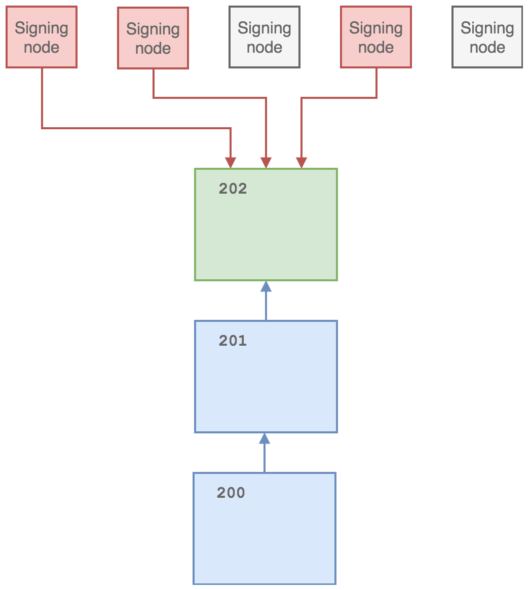

Block signing
========================

The Ocean platform incorporates a client/daemon that is installed and run on infrastructure controlled by the issuer to validate and sign blocks on an Ocean sidechain via a fault tolerant multiparty protocol (referred to as *Federated block signing* and the nodes with block-signing permissions as *The Federation*). The block signing permissions are defined by the public keys in the M-of-N multisig blocksigning script which is specified in the Ocean sidechain configuration (``signblockscript``). Each federation signing node coordinates with the other federation nodes to produce valid blocks and combining M signatures on a valid block extending the blockchain over a specified block creation interval. In addition to block creation and signing, the federation client can perform token reissuance operations with the same fault-tolerance properties enabling secure and verifiable inflation of assets according to a specified schedule. 

Illustration of a federation of 5 signing nodes, where 3 signing keys are required to produce a valid block to extend the sidechain. 

Instructions
------------

The federated block-signing daemon is a pure Python application and can be downloaded from the CommerceBlock Github `here <https://github.com/commerceblock/federation>`_. 

#. ``pip3 install -r requirements.txt``
#. ``python3 setup.py build && python3 setup.py install``
#. For the demo run ``./run_demo`` or ``python3 -m demo``
#. For the federation run ``./run_federation`` or ``python3 -m federation`` and provide the following arguments:
.. code-block:: bash
   --rpcconnect $HOST --rpocport $PORT --rpcuser $USER --rpcpass $PASS --id $NODE_ID --msgtype $MSG_TYPE --nodes $NODES_LIST

Federation arguments:

* ``--rpconnect``\ : rpc host of Ocean node
* ``--rpcport``\ : rpc port of Ocean node
* ``--rpcuser``\ : rpc username
* ``--rpcpassword``\ : rpc password
* ``--id``\ : federation node id
* `--msg_type`: Messenger type used. Possible values: 'kafka', 'zmq' (optional, default='kafka')
* ``--nodes``\ : List of node ip/domain names for zmq only
* ``--hsm``\ : Flag to enable signing with HSM
* ``--inflationrate``\ : Inflation rate
* ``--inflationperiod``\ : Inflation period (in minutes)
* ``--inflationaddress``\ : Address for inflation payments
* ``--reissuancescript``\ : Reissuance token script
* ``--reissuanceprivkey``\ : Reissuance private key

Example use:

* zmq: 
.. code-block:: bash
  python3 -m federation --rpconnect 127.0.0.1 --rpcport 18443 --rpcuser user --rpcpass pass --id 1 --msgtype zmq --nodes “node0:1503,node1:1502”
* kafka: ``python3 -m federation --rpconnect 127.0.0.1 --rpcport 18443 --rpcuser user --rpcpass pass --id 1`` (check federation.py - defaults to 5 nodes)

Hardware Security Modules
^^^^^^^^^^^^^^^^^^^^^^^^^^

The application has full integration for Hardware Security Modules (HSMs) that support the PKCS11 interface, for block-signing operations and key management. 

Initialisation
~~~~~~~~~~~~~~

Assuming HSM and pkcs11 libraries setup and all config/secrets files are in place run:

``docker build --build-arg user_pin=$USER_PIN --build-arg key_label=$KEY_LABEL -f Dockerfile.hsm.init .``

This will generate a multisig script that should be used as the ``signblockarg`` in the ocean sidechain.

Running
~~~~~~~

To build the federation container with hsm signing run:

``docker build --build-arg user_pin=$USER_PIN --build-arg key_label=$KEY_LABEL -f Dockerfile.hsm .``

Inside this container federation can be initiated by:

.. code-block:: bash
  python3 -u -m federation --rpconnect signing1 --rpcport 18886 --rpcuser username1 --rpcpass password1 --id 1 --msgtype zmq --nodes "federation0:6666,federation1:7777,federation2:8888" --hsm 1

Inflating assets
^^^^^^^^^^^^^^^^

The federation nodes can be used to reissue issued assets according to a fixed inflation schedule. This is enabled by setting the ``--inflationrate`` argument to a non zero value. The assets are then reissued every ``--inflationperiod`` blocks, and to the specified address. The reissuance tokens must be paid to the P2SH address of the supplied multisig script (\ ``--reissuancescript``\ ). The corresponding private key for the signing node (for the reissuance script) is supplied as ``--reissuanceprivkey``. If inflation is enabled, the ``-rescan=1`` and ``-recordinflation=1`` flags must be set in the signing node ``ocean.conf`` file. 

Federation protocol demo
------------------------

A demonstration of protocols used by the Ocean network, including federated signing and asset issuance.

Instructions
^^^^^^^^^^^^

``./scripts/restart_kafka.sh``
``python3 -m demo``

Running Kafka
^^^^^^^^^^^^^

* 
  Install kafka

    ``brew install kafka``

* 
  Add bin path to PATH in bash profile

    ``export PATH="$PATH:/usr/local/Cellar/kafka/1.1.0/bin/"``

* 
  Different services

  * ``brew services start kafka``
  * ``brew services stop kafka``
  * ``kafka-topics --zookeeper localhost:2181 --delete --topic new-block``

MultiSig
^^^^^^^^

Generate multisig script and keys using the MultiSig class (M out of N).

Federated Signing
^^^^^^^^^^^^^^^^^

Implement federation signing using the BlockSigning class. Federation signing uses a Kafka broker. Nodes take turns proposing / signing blocks. One node will generate a new block hex and send it to a topic marked as 'new-block' in the Kafka broker. The rest of the nodes will fetch this and sign it, sending their signature to a topic marked as 'new-sigX', where X is the node id. The node that generated the block will collect the signatures, combine them and submit the block.

Asset Issuance
^^^^^^^^^^^^^^

Issue assets and generate transactions with these assets using the AssetIssuance class.
