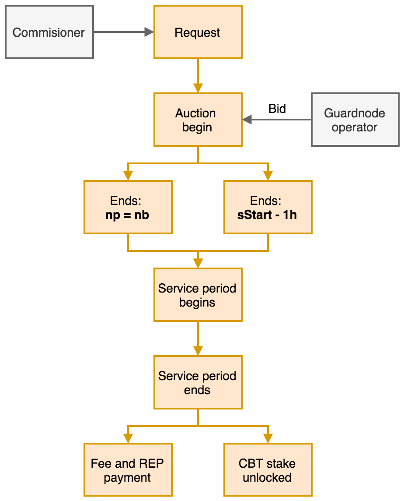
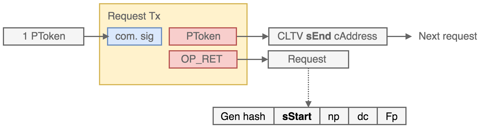
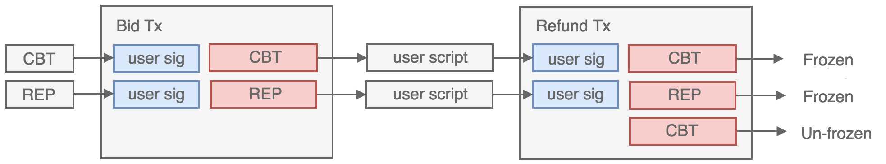
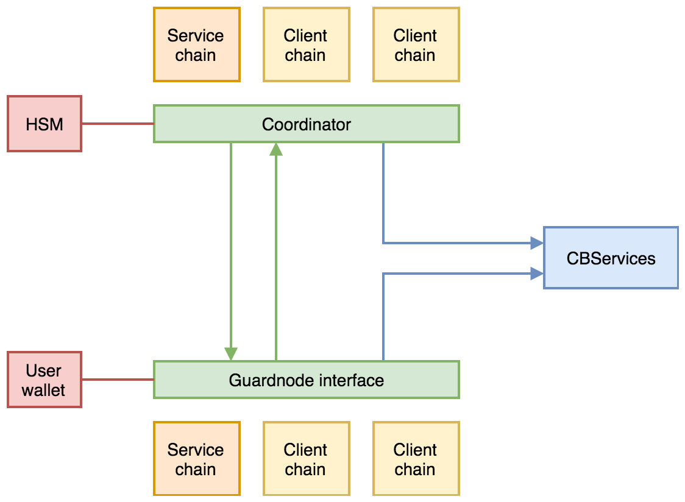

Guardnode protocol design
=========================

The CommerceBlock (CB) network is designed to support a system individually permissioned blockchains (sidechains) on which tokenised assets and securities can be issued and traded with minimum friction. The individual sidechains which form the CB network are federated via permissioned block-signers, however a distributed community of incentivised *guardnodes* secure the network consensus rules and provide distributed services to lightweight clients and sidechain users. These services are provided in exchange for a proportion of fee revenues on participating sidechains, and are coordinated via the CB root chain. This general architecture is highly scalable, extensible and gives tokenized asset and security issuers control over transaction policies yet maintain transparency, reliability and trust minimisation. 

The design philosophy and theory for the Guardnode system is described in the Covalence whitepaper. 

Network model
-------------

At the core of the network architecture is the CommerceBlock *service* blockchain which provides the platform for the token staking, ticketing and reputation protocols that coordinate the Guardnode system. The CB root chain is a fully public blockchain, with a Byzantine fault tolerant block-signing federation, and derives its immutability from the Bitcoin blockchain via the Mainstay protocol. The native token of the CB root chain is the CommerceBlock Token (CBT) which was issued on Ethereum (as an ERC20 token). CBT can be moved to the CB root chain from the ERC20 contract on the Ethereum blockchain via a federated one-way peg. 

Companies, institutions and consortia have the ability to launch customised and configurable permissioned federated sidechains with tokenized asset support, according to their own requirements and policies under their full control and on their own hardware. Tokenised assets and securities can then be issued on these sidechains and transacted peer-to-peer using CommerceBlock multi-asset wallet tooling. These so-called 'client' sidechains are capable of independent operation, however by agreeing to pay a proportion of the transaction fees generated on their chain, they can utilise the services of CB network Guardnodes to provide decentralised security and trust minimisation. 

The CB service chain and connected asset-backed client chains are public (but permissioned) blockchains, and anyone is free to run a fully validating client for any or all of them, and users with significant asset-backed token holdings will do this to perform full verification of transaction confirmations on client chains. In order to increase the decentralisation, security and utility of individual client chains, organisations and individuals are incentivised to run fully validating Guardnodes, which both enforce consensus rules and provide services to client chain users and lightweight wallets. Operators of Guardnodes are free to chose the client chains they wish to store, validate and provide services to, and are rewarded directly in tokens derived from the client chain transaction fees. In order to perform these services for the network and receive payments, individual Guardnode operators are required to bond (time-lock) tokens (CBT) on the CB root chain in return for a *ticket* to provide services for a particular client chain, which is valid for a specific amount of time. In addition, Guardnodes are required to provide regular proofs-of-blockchain-storage and service proofs to the CB block-signing federation to receive fee payments and *reputation* tokens. Tickets are obtained via a auction mechanism described below. 

Client chain stakeholders (i.e. federation members and asset/security issuers) can choose the percentage of the client chain transaction fees that are paid to the pool of guardnodes and the target node count ``np``. The client chain transaction fees (in asset backed tokens) are then split evenly amongst the guardnodes validating and storing that particular client chain (at specified intervals). The larger the potential transaction volume (and hence transaction fees) for a particular client chain, the more incentive there is for individuals and organisations to run guardnodes, and the greater the distributed security of that client chain. 

Guardnode overview
------------------

Guardnodes fully validate and permanently store the CB service blockchain and one or more asset or security backed client sidechains, and issue network alerts and fraud proofs if they detect invalid blocks or consensus anomalies. Any individual or organisation is free to run a guardnode and to choose which client chains to validate, monitor and store, which will be influenced by the cost of the storage and network connectivity, the required ticket staking price and the expected income from leaf chain transaction fees. A single 'Guardnode' by definition then connects to and validates multiple public blockchains, with that connectivity and validation controlled by the operator (user) via a single unified interface. 

The CB service chain provides the coordination platform for the guardnode system, and all request, network token, ticket and reputation operations are performed via service chain token-based transactions. This provides transparency and immutability for all network participants, and enables the CB service chain *coordinator* to control the operation of the system via token issuance. The guardnode and network interfaces interpret and abstract the on-chain transaction based logic to display the system status in a user-friendly way. 

The following sections describe the full process and protocol for the operation of the guardnode system. This consists of the principle stages of: 

#. Service request creation
#. Ticket auction and allocation
#. Service delivery and proof verification
#. Fee payment allocation and distribution

Fig. 1. Illustration of a sequence of request creation and fulfillment. 

Request creation: client chain connection
-----------------------------------------

To employ the services of distributed guardnodes on the CB network, an asset or security issuer that operates a client chain must apply to CommerceBlock to join the network and obtain permission to issue *requests* on the CB service chain. This permission is granted via the issuance of a *permission token* (\ ``pToken``\ ) to the address provided by the client chain *commissioner* (\ ``cAddress``\ ). This specific token enables the issuance of requests. The commissioner supplies the client chain information to the coordinator, where it is hosted on the CBServices portal. This information includes:

#. The client chain genesis block and block-signing script
#. The client chain federation end-points (IP addresses and port number)
#. Chain details and website URL

In return, the coordinator provides the commissioner with a client chain address (\ ``fAddress``\ ) to which transaction fees (or a proportion of) are paid on the client chain. This address is derived from a private key stored on a coordinator hardware security module (HSM). A request transaction consists of a single input (\ ``pToken``\ ) and two outputs: One time-locked (CLTV) output paying to the commissioner address and one zero value OP_RETURN output containing the encoded details of the request. The request details are as follows:

#. The client chain genesis block hash ``cGen``
#. The service period start time ``sStart``
#. The target number of tickets ``np``
#. The auction price decay constant ``dc``
#. The percentage of client chain transaction fees paid to guardnodes ``Fp``
#. The guardnode services required

The time-locked ``pToken`` output is set as spendable after a time ``sEnd`` (set via ``OP_CHECKLOCKTIMEVERIFY``\ ). The target number of nodes (\ ``np``\ ) is the number of distributed independent Guardnodes that the client chain operator determines are needed to meet their service level, security properties and decentralisation requirements. The higher this number, the smaller the fee income per Guardnode and the smaller the eventual ticket price - reducing the incentives and hence reliability of individual nodes. 

Fig. 2: Schematic of the creation of a request via a request transaction. 

The client chain commissioner can specify the services required, which include:

* Fork detection: Guardnodes monitor the network for conflicting leaf chain blocks and broadcast alerts with header proofs if detected. 
* Block validity monitoring: Guardnodes fully validate the leaf chain and construct and broadcast fraud proofs if invalid but signed blocks are detected. 
* Blockchain storage: Guardnodes maintain full archival copies of leaf chains and provide proofs of retrievability. 
* SPV proofs: Provision of lightweight transaction confirmation proofs (SPV proofs) to leaf chain user wallets. 

The request is created and signed by the commissioner wallet interface (with the private key for ``cAddress``\ ). Once created and broadcast to the service chain, the transaction is verified by the service chain with the additional policy rules: 1. That the request is correctly formed. 2. That the token ID is of type ``pToken`` 3. That the client genesis hash matches a known client chain and 4. That ``sEnd`` > ``sStart`` + 1 hour > current time + 2 hour. 

Once confirmed the request is active, and the ticket auction mechanism is initiated. 

Ticket stake auction
--------------------

Guardnode operators must hold a quantity of the service chain network token (CBT). This will correspond to a specific token type on the service chain, issued to users via the one-way peg to the ERC20 CBT token. The guardnode interface and user wallet displays the current balance of CBT, the current balance of reputation tokens (REP) and all currently active requests (where the current time < ``sStart`` - 1 hour). 

Tickets for a specific request are allocated to guardnode operators via a uniform price Dutch auction mechanism, which determines the final staking amount of CBT for all the tickets in a request. The auction becomes active as soon as the request transaction is confirmed on the service chain (i.e. within 1 minute of transmission) and ends 60 minutes before the specified ``sStart`` time. The requester is free to choose both the length of time the auction should run (\ ``sStart`` - 1 hour - request confirmation time), and the value of the stake price decay function constant ``dc``. These should be chosen in a trade-off between maximising both participation (reaching the target number of tickets ``np``\ ) and the final stake price (the commissioner is incentivised to maximise the stake as it optimises the reliability of the guardnode service providers). 

Guardnode operators can submit a bid for a ticket for a given request at any time the auction is still active (either up to the end time, or it finalises because the target ticket number ``np`` has been met). The guardnode interface displays the current status of a specific request (along with the request information). This status shows the current ticket stake price ``sp`` (which decreases every minute according to the auction decay function), the time remaining for the auction and current number of (cumulative) bids ``nb``. The operator can then make a decision on bidding. 

To submit a bid for a ticket allocated for given request, the operator submits a special *bid* transaction from their guardnode wallet. This transaction contains inputs of network token (CBT) equal to the current auction stake price (in addition to the network fee). If the user has any reputation tokens (REP) then the required auction price is reduced according to the reputation discount function ``repdis(rtokens)``. If that is the case, the reputation tokens must also be included as an input to the bid transaction (they will be locked for the duration of the service request). 

The bid transaction then pays both the staking amount (CBT) and reputation tokens (REP) to addresses controlled by the guardnode operator wallet (all staked token outputs always remain under the ownership of the holder at all times). In addition to these two outputs, a third zero value ``OP_RETURN`` output contains the ``TxID`` of the request transaction. This then links the bid to the request at the consensus layer. 

Once the bid is broadcast to the service chain signing nodes, it is accepted as valid and confirmed only if the following conditions are met: that the bid amount is consistent with the request parameters and the decay function (discounted by the reputation tokens) and that there are less than ``np`` submitted bids (i.e. ``nb`` < ``np``\ ). Once confirmed the bid is finalised and at this point the bidder is *guaranteed* a ticket - but the final required stake is not determined until the auction finalises. 

The auction finalises when either ``nb`` = ``np`` or the time reaches ``sStart`` - 1 hour (whichever is the sooner). Once the auction finalises, the final ticket stake price is set at the value of the auction decay function at the point of finalisation (i.e. the closing time or the bid of the ``np`` bidder) ``pfinal``. 

After this point, the stakes of CBT and REP in each of the confirmed bid transactions become locked and unspendable until the time ``sEnd`` encoded in the request is reached. The exception to this is if the value of CBT in the output is greater than ``pfinal`` (which is the case for all bids made before finalisation) - in this case, then one additional transaction (including the same request ``TxID`` as in the bid transaction) spending the CBT output is permitted with the rule that it contains two outputs: one for exactly ``pfinal`` and one for the difference (change). When confirmed, the ``pfinal`` output becomes locked and unspendable until ``sEnd``\ , and the other can be transacted freely. 

Fig. 3: Schematic of the creation of a bid transaction and the refund of the excess CBT at the end of the auction. 

The locked output then represents the ticket for the specified request - and the holder can prove their possession by providing a signature corresponding the address using in the locked CBT output. By performing the auction via on-chain transactions and enforcing the auction via consensus rules the process is transparent and immutable (via Mainstay) and so cheating (by anyone, including the coordinator) is impossible. 

Service delivery and verification
---------------------------------

The service interval commences at time ``sStart``. The guardnode interface (which has a direct connection to a service chain node) automatically determines when a ticket is valid and is about to become active. Depending on the configuration of the guardnode interface a client chain node will be instantiated either automatically or after a prompt is confirmed by the operator, and configured according to parameters retrieved from the CB coordinator (via a public API). The guardnode interface connects locally to the client chain node (running directly on infrastructure owned or controlled by the operator) which is used to monitor the client chain network. 

The guardnode operator is responsible for maintaining uninterrupted and low latency TCP connections between the client chain node and the client chain P2P network, and HTTPS connections to the service chain coordinator API and the alert system API (with a fixed IP address that is sent to the coordinator at the start of the service interval). The full list of guardnode IP addresses is made public and listed on a web-page for a specific active request on the CBServices portal. As part of the connection process, the guardnode must prove ownership of the ticket by signing a message with the private key of the bit transaction output address. 

Service proofs
^^^^^^^^^^^^^^

It is necessary that the guardnode operator maintains constant connections to the client chain P2P network and fully validates all blocks on the client chain, according to the consensus rules and configuration of the client chain. In order to receive payment for the service, the guardnode must demonstrate that it is doing this and storing a full archival copy of the client blockchain. 

This is demonstrated using a challenge-response protocol which is initiated by the coordinator at random intervals throughout the service period. The coordinator sends a CHALLENGE asset transaction to the relevant client chain and measures the time taken for the guardnode to construct a response. The response time is required to be small enough that the guardnode would not be able to produce the response if they did not have a local copy (i.e. they had to query another node on the P2P network). 

In addition to the challenge-response protocol, the coordinator can query the connection status of the guardnode client chain node and obtain the current peer list. This can then be used to confirm the operation and connectivity of each guardnode via a number of independent peers (i.e. that the connection status of separate guardnodes is consistent). 

Alert system and interface
^^^^^^^^^^^^^^^^^^^^^^^^^^

The guardnode is configured to recognise when it receives two (or more) blocks (or block headers) on the client chain at the same block height with valid signatures. This is direct proof of a consensus fork - and should not happen under any circumstances (unlike in Bitcoin) if the block-signing keys are secure. Conflicting block signatures mean that the block-signing nodes have been compromised and that a potential double-spend attack is underway (e.g. with an attacker sending different blockchain histories to different network participants). If this happens, all users should cease transacting until the situation is investigated and resolved via a network wide upgrade, and so long as a single valid history is agreed up to the conflict point, the proof of ownership of client assets is assured. 

When a conflicting block is detected, the guardnode sends an authenticated *fraud proof* to both the CBServices portal and third-party forums (e.g. mailing lists, Twitter etc.). The fraud-proof consists of two valid (i.e. signed with the client chain block-signing script) block-headers at the same block height. This fraud proof is signed with the ticket address key, and can then be independently verified by anyone as incontrovertible proof of chain consensus failure. 

Fig. 4: Illustration of the coordinator and guardnode interface connectivity and architecture. 

Service fee payments
--------------------

At the end of the service period (as specified in the request) ``sEnd`` the guardnode interface can halt the client chain node (if there is no automatic renewal protocol enabled - see below) and stop responding to service proof requests. 

During the service period specified in the request, the specified proportion of transaction fees generated on the client chain is paid to ``fAddress`` (which is controlled by the coordinator via an HSM). This payment occurs *on the client chain* in either a native token, pegged in token or an asset-backed token. At the end of the service period, the coordinator determines which of the ticket holders have satisfactorily provided the guardnode service (by timely responses to challenges) and divides the payment ``fAddress`` among the qualifying ticket holders. The fee portion is paid to the address of the locked CBT output of the bid/ticket transaction. (it is assumed the client chain will be an Ocean based chain, and therefore have a compatible key/address format to the service chain)
