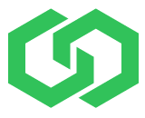

CommerceBlock Documentation Index
=================================================

Commerceblock provides public blockchain based technology and infrastructure that enables the tokenisation of assets and securities on fully independent blockchains (federated sidechains) that derive trustless immutability from the Bitcoin network Proof-of-Work consensus process. We have created an open-source ecosystem that provides all the tools required to launch and operate permissioned sidechains with customisable transaction and user policy and full KYC/ID provider integration.

Independent permissioned sidechains built using CommerceBlock technology and utilising CommerceBlock services have the following advantages:

- Issuer controlled transaction and user policy
- Issuer controlled transaction fees
- Enterprise-level transaction rates and scalability
- Full KYC/ID provider integration
- Customisable block explorer and lightweight and mobile wallet implementations
- Multisig token issuance with asset management and reporting tools
- Backed by Bitcoins Proof-of-Work via the Mainstay protocol

This documentation covers the central components of the CommerceBlock technology stack, including the sidechain client Ocean, the process of sidechain creation and operation via a permissioned federation of block signing nodes, the tools for controlling user whitelists, and the tools that enable the management and mapping of issued tokens. In addition, the full protocol descriptions and documentation of the two services offered by CommerceBlock to secure individual sidechains: Mainstay and the Guardnode system, are included.

.. note::
  All CommerceBlock software is fully open-source and free to use, available via our Github repository:
  `github.com/commerceblock <https://github.com/commerceblock>`_. Technical questions and suggestions
  for improvements can be raised as issues on the relevant repos. In addition, technical questions related
  to our software and processes are welcomed on our Telegram group.

.. toctree::
   :maxdepth: 2
   :caption: CommerceBlock Platform:

   introduction/index

.. toctree::
   :maxdepth: 2
   :caption: Ocean sidechain client:

   ocean/index
   policy/index
   ocean-config/index
   running-node/index
   federation/index
   ocean-api/index
   ocean-wallet/index

.. toctree::
   :maxdepth: 2
   :caption: Mainstay:

   mainstay/index
   mainstay-background/index
   mainstay-protocol/index
   mainstay-con/index
   mainstay-tools/index
   mainstay-api/index
   mainstay-sidechain/index

.. toctree::
   :maxdepth: 2
   :caption: Guardnode system:

   guardnodes/index
   bidding/index
   coordinator/index
   guardnode/index
   guardnode-guide/index
   request-guide/index
   twowp/index

.. toctree::
   :maxdepth: 2
   :caption: Asset management:

   map-specification/index
   mapping/index
   map-init/index
   issuance/index
   redemption/index
