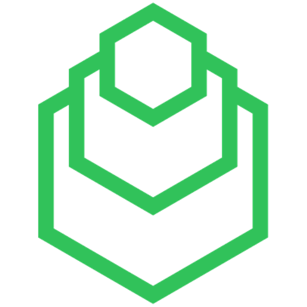
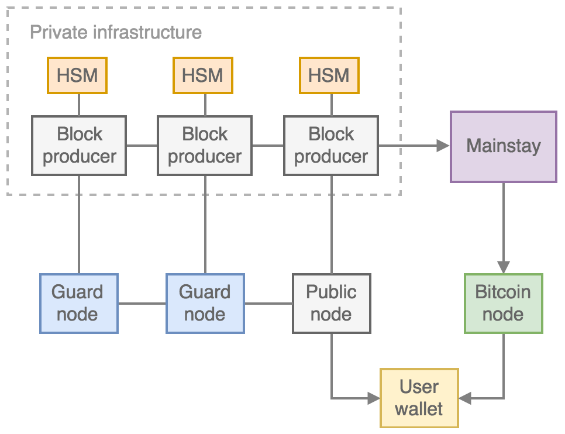

Ocean Platform
================

The open-source Ocean platform has been developed to enable the tokenisation of assets and securities by companies and institutions. To remove the unnecessary second layer of trust required on a shared blockchain platform, the Ocean platform enables asset custodians to issue tokens on a permissioned sidechain that they control, but which has trustless immutability derived from the Bitcoin blockchain proof-of-work.

Immutability and censorship resistance are the two revolutionary properties that the decentralisation the Bitcoin blockchain has provided. However, for many applications token issuers do not require or desire full censorship resistance — certainly for asset or equity backed tokens, as there is intrinsic permission required from the issuer to redeem an asset. In addition, issuers of security tokens may be legally required to control who can transact with a token and when. The value of having tokens issued on a blockchain in this design is that the ledger is publicly verifiable: it provides independent and legal proof of ownership and transfer of ownership of a token representing an asset or security — a cryptographic proof based on the possession of private keys. If the blockchain on which the token is transacted is also trustlessly immutable, then you can prove your ownership of the token, and hence the asset, independently.

The Ocean platform model simultaneously achieves 1) the *trustless* immutability that can only be provided by public, global proof-of-work via Bitcoin and 2) the legal control, scalability and reliability offered by publicly verifiable permissioned blockchains. This is accomplished via an architecture where asset backed blockchains - controlled by the asset issuer - can individually link to the CommerceBlock *Mainstay* service that immutably binds the sidechain to the Bitcoin blockchain. Companies, institutions and consortiums can then launch customised and configurable federated blockchains with tokenized asset support and full ID/KYC integration, according to their own requirements and policies. Assets can then be issued on these blockchains and transacted peer-to-peer via the Ocean Wallet.

Asset-backed sidechains can be configured as either private or publicly verifiable blockchains. If configured as public, the security and decentralisation of the network can be optionally enhanced through CommerceBlock's *Guardnode* network. 

The Ocean sidechain client (incorporating full node and wallet) is derived from the open-source Elements project, which in turn was built from the main Bitcoin Core codebase. The core routines, data structures and cryptographic algorithms are the same as those used in the Bitcoin protocol, which is the most secure and battle-tested blockchain platform ever created.

Ocean sidechain features
################################

Immutability
------------

Ocean sidehchains linked to the Mainstay service are as trustlessly immutable as Bitcoin, backed by the global decentralised Proof-of-Work consensus system. Ocean sidechains are fully verifiable, and their immutability can be independently verified by third-parties via Mainstay tooling with a connection to a Bitcoin full node.

Permissions
-----------

Ocean sidechains operated by token issuers have the capability to incorporate user address whitelists and blacklists into the block-producing node policy rules, which enables token issuers to control transaction permissions. The control of these policy lists is performed via the blockchain itself (with special permission control private keys), so no additional infrastructure or databases are required. The permission control can be integrated directly with KYC/ID check providers (such as Onfido) for a seamless user experience.

Security
--------

Blocks are created via fault-tolerance consensus of a federation of block-signing nodes, which can be under the control of a single legal entity or a number of separate legal entities. The block signing protocol is fully integrated with the major hardware security module (HSM) interfaces (PKCS11/JCE/JCA). Forking or double-spending on the sidechain is prevented with Mainstay and Bitcoin's Proof-of-Work consensus - removing the requirement for full trust in the federation nodes.

Control
-------

The issuance and creation of tokens on a sidechain can be configured to have custom multisignature permissions, where a number of separate parties are required to sign an issuance transaction. Asset management and mapping tools enable tokens to be linked with real-world assets and securities, tokens can be reissued and redeemed.

Sovereignty
-----------

Sidechains remain under the full control of the federation (or token issuer) and can operate completely independently of CommerceBlock and CommerceBlock services if desired at any time. Token owners/holders control their own private keys, and the lightweight Ocean Wallet client (based on the Electrum protocol) can integrate easily with hardware wallets.

Transaction Fees
----------------

Full control of the sidechain enables asset issuers to set the transaction fee policy according to their own requirements, which can be fixed or proportional to transaction size or value, or even remove the requirement for fees entirely. This enables users and token holders to have long term guarantees on the cost of using the platform. This is in contrast to fully public blockchain networks, where the transaction fees and confirmation times are unpredictable and can potentially prevent token holders from transacting.

Scalability
-----------

Sidechains are independently controlled, so transaction throughput is not constrained by a separate network. Scalability can be controlled by the asset issuer and the block-signing nodes, and is only really limited by hardware. Ocean nodes can be launched easily on cloud infrastructure, being fully containerised (with Docker images for the major cloud providers). Attestation to Bitcoin via Mainstay requires only one Bitcoin transaction every 10 minutes, the cost of which is shared among all sidechains using the CommerceBlock Mainstay service. 

.. note::
	Ocean is released under the terms of the MIT license.

.. hint::
	For a more extensive set of documentation for the Elements platform, including easy to understand descriptions of the underlying technologies and detailed tutorials and examples, visit `elementsproject.org <http://elementsproject.org>`_.
