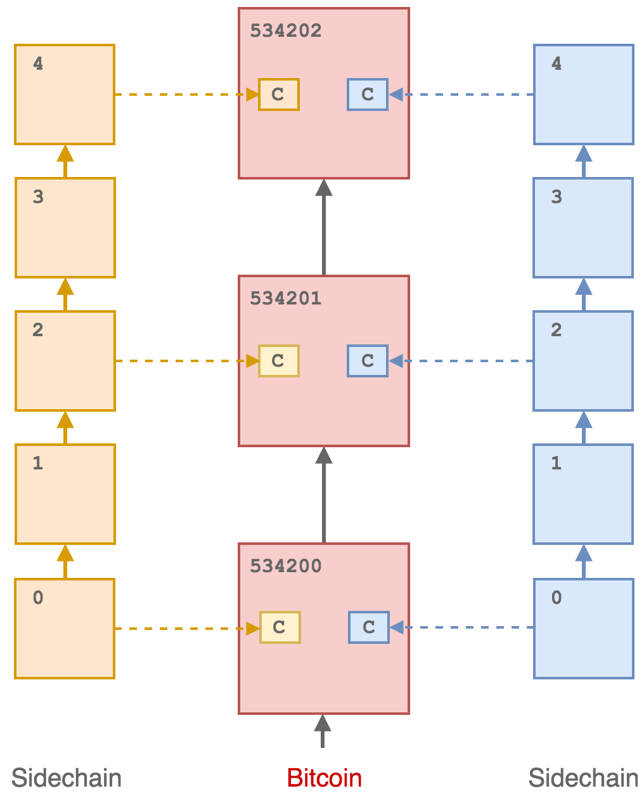

Background
============

The invention of Bitcoin solved the issue of double-spending in a fully decentralised digital
payments system by ensuring that there is a *single*, replicated, global ledger that all participants can agree represents the valid ordering of transactions: the blockchain. Reaching
consensus on the state of this global ledger is achieved using *proof-of-work*: adding to the
blockchain requires expensive, but easily verifiable, computations that are rewarded with
tokens derived from transaction fees (and block rewards). The blockchain with the most
accumulated work is considered the only valid history, and all participants are incentivised
to contribute their computational work to extending it.

The use of proof-of-work, which requires the consumption of real world resources (i.e.
energy), as the consensus mechanism means that Bitcoin is completely permissionless: no
permission is required in order to add to the blockchain - only computational work. The
work required to extend the blockchain also leads to immutability: any attempt to modify
the time-order of transactions in the blockchain requires more computational power than
the rest of the network combined. This leads to the Bitcoin blockchain being a unique
global system of consensus on the ordering of time-stamped events without the need for any
trusted authority. 

Of all the cryptocurrency projects that have been launched since, Bitcoin remains by far the
most secure, with the most accumulated work. The Bitcoin network has operated persistently
for over 9 years, holding hundreds of billions of dollars in value and has resisted constant
attack. However, these properties come at the cost of both scalability and upgradability.
In order to maintain the decentralisation, security and censorship resistance of the network,
block sizes must remain relatively small which limits the transaction capacity: Bitcoin
can process only 3 to 6 transactions per second leading to unpredictable transaction fees and
confirmation times. In addition, for the very same reasons Bitcoin is so secure, it is also
very difficult to change the protocol: adding new features requires the consent of all network
participants and must be done extremely conservatively so as to not risk the integrity of the
system.

Alternative consensus mechanisms on separate blockchains can be used to improve scalability
and build in more advanced features. Sidechains to Bitcoin secured
by federated consensus rules enable significantly better scalability, and much faster and
more regular block times. In addition, these systems can incorporate more protocol-level
functionality, including token issuance and cryptographic privacy and
anonymity features not possible on Bitcoin. However, such systems are not able to achieve
the trustless immutability of Bitcoin with permissionless proof-of-work. Blockchains that
are run by a static federated consensus mechanism require collective trust in the federation
members: if the federation members collude or leak a threshold of secret keys, conflicting
forks of the blockchain can be created at no cost and double-spend attacks launched against
token holders.

To provide federated sidechains with the same level of trustless immutability as Bitcoin, we
describe a method that involves cryptographically binding sidechains to the Bitcoin
mainchain in such a way that the sidechain cannot be forked without also simultaneously
forking the Bitcoin mainchain. This means that for a fixed set of federated block signers,
users of a sidechain do not need to trust the federation to protect them from a double-spend
attack: proof a single unforked version of the federated sidechain is provided by
Bitcoin’s proof-of-work.

Attestation and Timestamping
----------------------------

It was recognised early in Bitcoin’s history that the blockchain could be utilised to timestamp arbitrary data in a completely trustless and decentralised way. By embedding a cryptographic commitment to data into a valid transaction, which was then
mined into the blockchain, it was possible to prove that the data existed at a particular time. To accomodate time-stamping (and other meta-protocols) in a more efficient way, a new prunable transaction output type was
introduced via a new OP code: ``OP_RETURN``. This allowed up to 40/80 bytes to be
included in an output which was not treated as a spendable output in the UTXO
set. The use of ``OP_RETURN`` however has significant downsides: it bloats transactions (resulting in
higher transaction fees), it offers no privacy (data is included in plain text directly into the
transaction) and transactions including them may be rejected (censored) by mining
pools. 

There are many services that employ ``OP_RETURN`` outputs to time-stamp single files into the
Bitcoin blockchain and there are protocols that can include a much more extensive set of data into a
single commitment, such as `OpenTimestamps <https://opentimestamps.org>`_ which collects submitted commitments via a calendar server and compresses them into Merkle Tree, and then time-stamps the Merkle
Root in a transaction. This type of time-stamping is however fundamentally limited in the type of immutability it
can provide. A timestamp can only prove that a particular piece of information *existed* at
a certain point in time, not that the information has any other validity or *uniqueness*. A
timestamp by itself cannot prove that a commitment to conflicting data has not also been
simultaneously timestamped. This is a critical concept in relation to immutability and provenance: any
*proof-of-existence* (i.e. a timestamp) does not act as a proof that anything else (e.g. an alternative ordering of
transactions or version of a document) does not also exist. 

Illustration of conflicting sidechain blocks simultaneously attesting to a mainchain.

To illustrate this point, we consider a sidechain or alt-chain whose state (i.e. the chain tip
block header) is periodically time-stamped into the Bitcoin blockchain. This does not lead
to immutability of the sidechain, since alternative conflicting states (i.e. forks) can also be
time-stamped simultaneously. Any property of immutability and provenance then must ensure
that the sidechain state is linked to a specific commitment in the Bitcoin chain via
some trusted mechanism - some authority (who may be effectively operating the sidechain)
is responsible for defining the sequence of timestamps that correspond to the un-forked
sidechain. This then relies on the integrity of the commitment mechanism: multiple versions
of a sidechain can be created with multiple simultaneous timestamped commitments into
Bitcoin. This could be used to execute a double spend attack by collusion of a block signing
federation with the commitment authority.

The MainStay protocol is designed to eliminate the requirement for any type of trust in creating a cryptographic proof of immutable sequence (PoIS) by
initiating a *fan-in-only* transaction *staychain* within the Bitcoin blockchain that is uniquely
committed to the genesis block of a sidechain, as described in the next section. The
protocol does not employ OP_RETURN outputs, providing additional privacy, censorship
resistance and efficiency. 