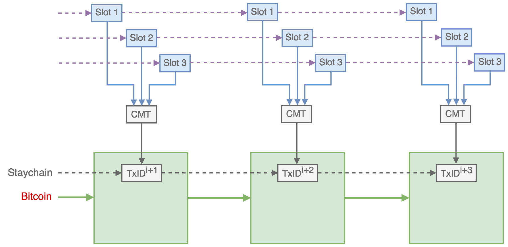
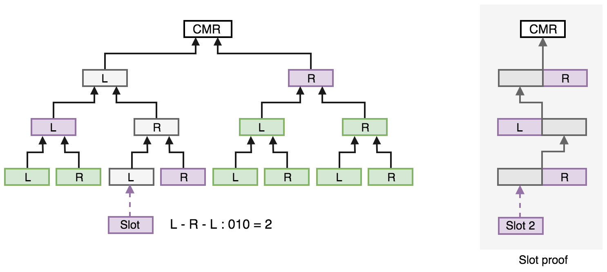
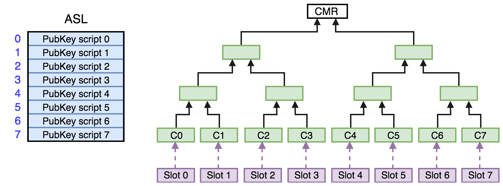
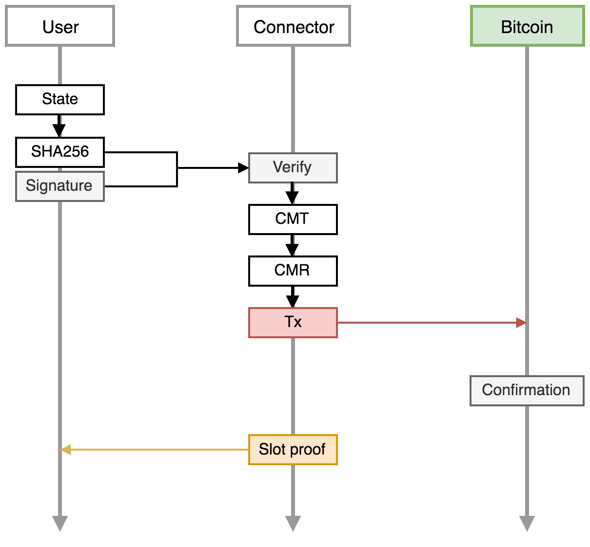
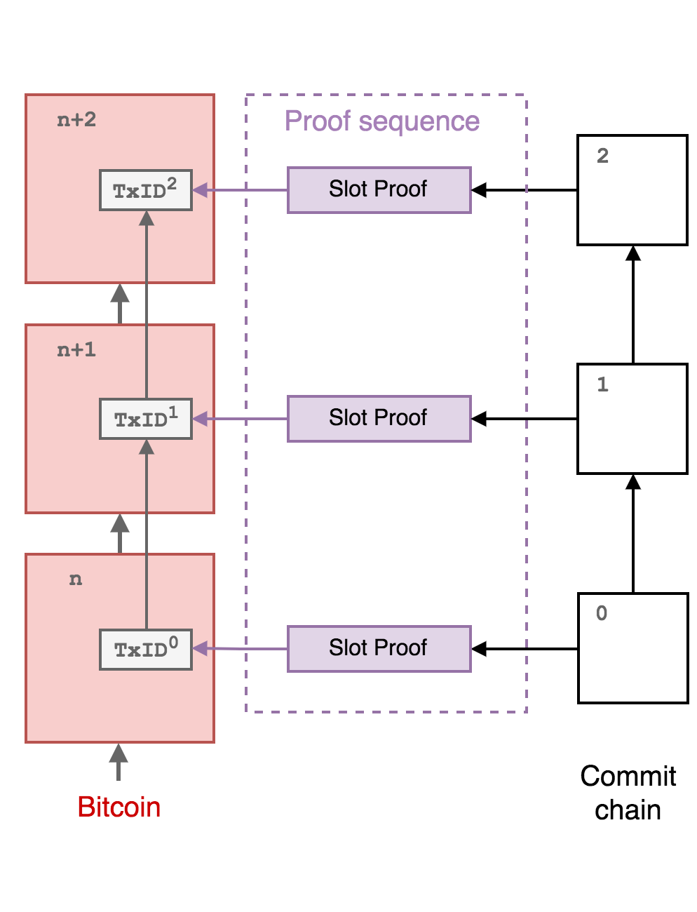

Mainstay Service Protocol
===========================

This document describes the overall design and principles of the Mainstay connector service protocol which is used to provide trustless immutability to third party systems as a service. This immutability is derived from the Bitcoin blockchain Proof-of-Work in an extensible, scalable and efficient way.

Overview
--------

The primary purpose of the Mainstay scheme is to provide a cryptographic *Proof of Immutable Sequence* (PoIS) for a succession of changing states of some arbitrary system or process - i.e. cryptographic proof that the sequence of states has only a single, linked, verifiable history that cannot be altered (or double-spent) without trusting any authority. This PoIS is obtained via the trustless immutability and uniqueness inherent to the Bitcoin blockchain, where proof-of-work (via the *permissionless* mining of blocks to extend the chain) creates a practically irreversible, incorruptible and *gloabally unique* ordering of transactions that does not rely on trust in any entity. The external system with a 'sequence of changing states' that can be proven as immutable and unique via the Mainstay protocol may in some instances be a separate blockchain (i.e. a *sidechain*). However, there are many other systems and processes where a PoIS (which is a proof of a single verifiable history) is of substantial value, such as in document tracking processes, critical software development and organisational governance.

The underlying mechanism of the Mainstay protocol is a sequence of successive `commitments <https://en.wikipedia.org/wiki/Commitment_scheme>`_ to a *fan-in-only* sequence of linked `transactions <https://en.bitcoin.it/wiki/Transaction>`_ on the Bitcoin blockchain, where each transaction has only a single output - referred to as the *staychain*. By enforcing the rule that all the transactions in the staychain can only have a one output, the staychain can only have a single, non-branching history from the base of the chain to the tip. Following this rule, the staychain state is as immutable as the Bitcoin blockchain and is backed by its immense proof-of-work. Verifiable state commitments to the staychain are then also immutable, and the immutability of any sequence of committed states can be proven by verifying the validity of the staychain.

State commitments are made to staychain transactions using the homomorphic *pay-to-contract* scheme, where the public key of the output is modified verifiably by the commitment value. This enables the commitments to be verified independently while the staychain remains indistinguishable from other standard bitcoin transactions. The commitment embedded in a particular staychain transaction output consists of a single 256 bit number, however this can in turn incorporate a number of separate commitments as a `Merkel Tree <https://en.wikipedia.org/wiki/Merkle_tree>`_ where the Merkle tree *root* is committed to the staychain and a *leaf* commitment inclusion can be verified via a Merkle path proof.

In order to maintain the property of *uniqueness* for sequential commitments in sequential Merkle Trees anchored to the successive transactions of the staychain, only one simple additional rule *must* be followed: each commitment from a particular seqeunce of states must always be be verifiably committed to the *same* leave position within the Merkle tree. If the commitment is always validated in the same position, then the sequence is as immutable and unique (as in having only a single possible non-branching history) as the the root commitment into the staychain.

Schematic of the commitment of states from three slots to the Connector Merkle Tree (CMT) which is then committed to the Bitcoin staychain, over three consecutive blocks. The sequence of commitments to a specified slot is as immutable as the the Bitcoin staychain.

The Mainstay service protocol provides a mechanism for service users to access a specific position in the commitment Merkle tree (refered to as a **slot**) which is then regularly committed to a unique Bitcoin staychain. This enables the provision of *Immutability as a Service* where a number of sidechain or other systems/processes can commit to and utilise a single Bitcoin staychain, at a substantially reduced cost (in terms of Bitcoin transaction fees) compared to operating a separate transaction staychain within Bitcoin for each individual application. The service provider operating the staychain, and the connection service, can agree service terms for each user and then assume responsibility for propagating the staychain and paying the Bitcoin fees.

Commitment Merkle Tree
----------------------

A Merkle tree is a data structure that enables a list of cryptographic commitments to be compressed into a single Merkle root with efficient and secure verification. As a result of the binary tree structure, a cryptographic proof that a specified commitment is included in the derivation of a root can be verified with O(log n) complexity, and the proof requires only O(log n) storage. A Merkle tree is defined by hash function (i.e. ``SHA256``) and an assignment function, which maps each node to the concatenation of the hashes of its child nodes. Each parent node `N` is then defined from the left (L) and right (R) child nodes as:

::

    N(Parent) = SHA256(N(L)||N(R))

*Proof* of the inclusion a commitment (as a leaf of the tree) is then generated from a traversal of the tree from the leaf through to the root, and is authenticated by verifying the path of concatenated hashes. However - for the connector protocol - the additional requirement in order to prove immutability and uniqueness across successive commitments is that a particular sequence of successive commitments from an external (client) process are included in the corresponding sequence of Commitment Merkle Trees (CMTs) in the **same** leaf position each time the root is committed to the Bitcoin staychain. This specific Merkle leaf position is referred to as a *slot* and is designated by an integer ``slotid``.

The ``slotid`` is defined according to the binary *path* from the leaf through to the Merkle root, which consists of the sequence of ``L`` and ``R`` concatenations (see Fig. 2). The ``slotid`` defined in this way does not change as the tree is extended with more leaves (slots) and the depth of the tree is increased (increasing the depth of the tree will simply increase the size of the proof path).

Schematic of the structure of a CMT with 8 leaves, where the leaf position (slot) is determined by the path. The sequence of concatenated hashes from the leaf through to the root forms a slot-proof that a commitment was made is a specified position.

Slot-proofs
^^^^^^^^^^^

The Mainstay service maintains a current version of the full tree as commitments are added from users via slots (see below). If a slot is not active (i.e. is not associated with a client or user) or the user has yet to submit the first commitment, the corresponding leaf commitment is set to zero. Once the root of the current updated tree (``merkle_root``) is committed into a new staychain transaction, then *slot-proofs* are generated for each ``slotid`` with a submitted commitment. The slot-proof consists of the hash sequence and concatenation order for the specific Merkle path to the ``merkle_root``.

The slot-proof for a specific ``slotid`` provides cryptographic proof that a particular ``commitment`` was committed to a specified staychain transaction (identified by the transaction ID ``TxID``) at that specific slot position.

Example slot-proof for a commitment in ``slotid = 1``:

.. code-block:: json

    {
        "txid": "38fa2c6e103673925aaec50e5aadcbb6fd0bf1677c5c88e27a9e4b0229197b13",
        "commitment": "d235db29356bb02f37e16712c4d34a724282fd81134fbfda61407b3009755a9e",
        "merkle_root": "f46a58a0cc796fade0c7854f169eb86a06797ac493ea35f28dbe35efee62399b",
        "ops": [
        {
            "append": false,
            "commitment": "5309053b9d4db8f86d2c7ec164645bdf1669111280e49e04c036c323b58f4709"
        },
        {
            "append": false,
            "commitment": "213e122aaec314a94f111dd8dc797814660b680f7258f1d95adec56318eabd7c"
        },
        {
            "append": true,
            "commitment": "406ab5d975ae922753fad4db83c3716ed4d2d1c6a0191f8336c76000962f63ba"
        }]
    }

To obtain a Proof of Immutable Sequence (PoIS) one or more slot-proofs on same staychain and with the same ``slotid`` are required as described below.

Slot connection
---------------

Individual users (clients) of the connector service are granted exclusive permission to add a 32 byte commitment to a specific ``slotid`` for as long as a service agreement remains in force. Upon the commencement of a service agreement with a client, the client will be assigned a free ``slotid`` (the lowest number currently unused). The client can optinally provide a public key for authenticating a submitted commitment. In addition, the client will be provided with API access details and an access token to securely submit the commitment.

Schematic of a CMT with 8 slots. The mapping to the active slot list (ASL) is shown.

On the initiation of a connection, the client identifier (and optionally the client public key) is added to the *active slot list* (ASL) in the position corresponding to ``slotid``. The connector service API then recieves authenticated commitments from the client and if required, signatures are verified using the client public key. If the API token is valid, and commitment signatures are valid then the commitment is added to the CMT at the ``slotid`` position. The connector server updates the cached CMT root (``merkle_root``) each time a new slot commitment is recieved and verified. New verified commitments arriving for a particular slot overwrite the pervious commitment.

At intervals determined by the staychain attestation frequency, the commitment server then commitments the ``merkle_root`` to the Bitcoin staychain following the BIP175 *pay-to-contract* protocol.

Protocol and message flow for a user interacting with the service via a single slot.

Once the commitment transaction has been confirmed (i.e. mined into a Bitcoin block), the service then generates slot-proofs for each of the active slots. These slot-proofs are then available to retrieve by the clients via the connector service API. The status of any commitment (i.e. whether it is pending or confirmed) can be checked at any time via the service API. 

Proof of Immutable Sequence
---------------------------

Clients can retrieve slot-proofs from the Mainstay service API as they become available, or they can retrieve previous state slot proofs, or any proof sequence for a specified slot. A proof of immutable sequence (PoIS) will consist of one or more slot proofs depending on the application and the state commitments that have been made to the slot. In general, for proving a single history of a sequence of state changes, this will consist of an array of slot-proofs: a slot-proof sequence (SPS). The SPS will enable a trustless proof that only a single sequence of commitments have been made to the specified slot, that can be verified by anyone. 

Formation of a slot-proof sequence from a series of consecutive state commitments.

Commitment frequency and fee policy
-----------------------------------

The service agreement with individual slot clients will specify the target staychain commitment and transaction frequency and fee policy. Due to the inherent nature of proof-of-work, the block generation interval on the Bitcoin blockchain is highly variable, and there is no guarantee of transaction confirmation in any particular time period which is also subject to the level of network congestion.

The staychain policy will specify a target transaction period ``ctarget`` (e.g. 1 hour) and the connector server will generate and broadcast a new staychain transaction containing the CMR every ``ctarget`` interval (irrespective of how many Bitcoin blocks have been generated). The transaction fee will initially be set at the value estimated (via a third party fee estimation app) for confirmation within 3 blocks, up to a maximum of value of ``maxfee``. ``maxfee`` (in BTC) is the maximum fee the service will pay per hour. In the case a transaction is not confirmed within 1 hour (due to network congestion and ``maxfee`` being insufficient) then the staychain transaction (updated with the latest CMR) is re-broadcast with an additional ``maxfee`` for the next 1 hour period (i.e. the fee will now be 2x ``maxfee``\ ) using the replace-by-fee (RBF) . This will then be repeated each ``ctagrget`` until the transaction is confirmed. 

The value of ``maxfee`` may be increased and ``ctarget`` decreased as more clients join the service, increasing the reliability and regularity of proofs.

Staychain multi-signature security
----------------------------------

A fundamental property of the Mainstay protocol is that users do not have to trust the connector service (or anyone else) to guarantee immutability - this is provided by the global proof-of-work securing the Bitcoin blockchain combined with slot-proofs. However, in order to provide a continuous and reliable service, the staychain of commitment transactions must remain in the control of the connector service. If the private keys controlling the staychain output (i.e. the base private keys) are lost or stolen, then the new state commitments cannot be immutably linked, and users would be forced to coordinate updates to a new staychain. To provide the required security and resiliency of the service the staychain is controlled by a multi-sig script (as described in the whitepaper). In addition, each base private key (``xpriv[i]``) of the staychain is generated and secured inside of a BIP32-compatible hardware security module (HSM).
