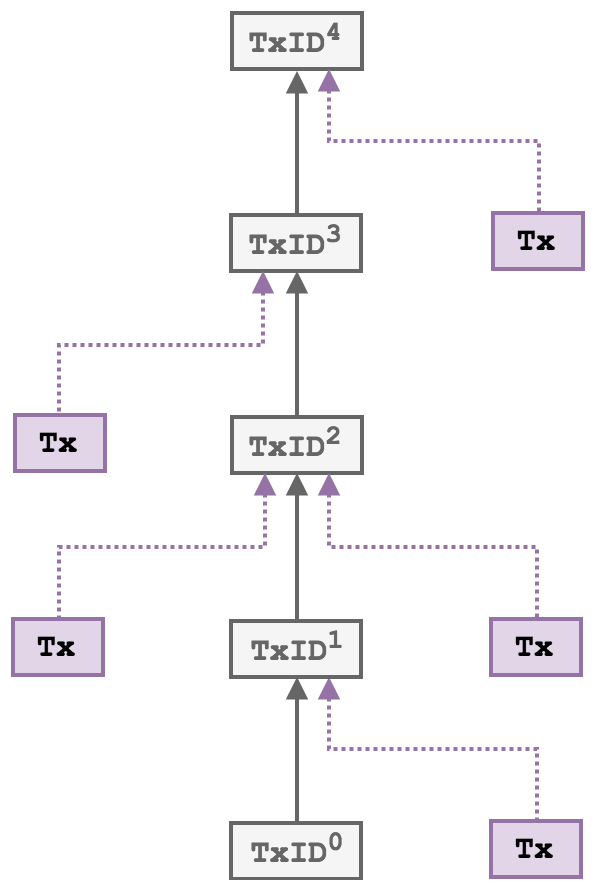

Protocol
============

The MainStay protocol employs the underlying concept of a *staychain* of linked transactions within the Bitcoin mainchain, where all transactions in the staychain are conform to having only a a single output, 
preventing branching and any possibility of alternate staychain
histories. By anchoring the staychain *base* transaction ID into the genesis block of the sidechain,
and then committing the state of the sidechain at regular intervals into the staychain, it
becomes impossible to roll back or re-write the state of the sidechain without also rolling
back the staychain, which is effectively impossible due to the might of Bitcoin’s global proof-
of-work. Sidechain nodes can validate these commitments and the resulting immutability of
the staychain using only lightweight SPV1 proofs from full Bitcoin nodes. When a sidechain
block has been committed to a Bitcoin staychain, we say that block is reinforced and is as
immutable as a Bitcoin block of the same depth.

To minimise the encumbrance of the mainstay on the Bitcoin blockchain, and to prevent any
potential miner censorship of transactions containing ``OP_RETURN`` outputs, we employ a
homomorphic commitment scheme based on the ‘pay-to-contract’ (BIP175) protocol. In
this approach, commitments from the sidechain are embedded in a single transaction output
address, and the staychain is indistinguishable from normal Bitcoin payment transactions.
We have designed the scheme so that it is compatible with both multisig (``P2SH``) and single 
public key (``P2PKH``) addresses, and that no additional hosted data is required in order to
verify the validity of the proof of immutability (PoI). 

The aim of the MainStay protocol is to restrict a sequence of periodic commitments from an external system (referred to here as 
the *sidechain*) to 
an un-forkable staychain of transactions in Bitcoin, and to uniquely
bind this staychain by linking to it directly from the sidechain itself. We define a staychain
as a sequence of linked transactions where each one has only a single output - transactions
can have more than one input (fan-in), but maintaining single outputs means only one
sequence of commitments is possible from a given initial transaction (Fig. 2). Each unique
transaction output then represents a single use seal.

If the security proposition of a sidechain depends on the integrity of the mainstay then
the mechanism of propagating the staychain must be robust and immune from attack: if the
staychain fails to propagate or is corrupted (e.g. having multiple outputs) then the sidechain
will lose the guarantee of immutability - howver it will remain *fail secure*. 

In the following general description of the protocol, we assume a single mainstay key and signing entity. The
protocol is also presented in relation to Bitcoin as the proof-of-work mainchain, but it is in
principle compatible with any PoW blockchain.

A schematic of a *fan-in-only* chain of linked transactions. By enforcing single
outputs only one possible sequence of transactions is possible.

Initialisation
--------------

The initial step in the protocol is the creation of the base transaction ``TxID_0``, which is
performed before the initialisation of the sidechain.

1. The signing entity generates a secret key ``sk_0`` , and corresponding base public key ``pk_0 = sk_0 × G`` ( ``× G`` denotes multiplication of the generator point on the secp256k1 elliptic curve). The public key is then used to create the base address: ``Addr_0``
2. Funds (Bitcoin) are paid to the base address to at least cover the initial transaction fees.
3. The signing entity then creates a transaction (the base transaction) paying these funds again to the same ``Addr_0`` in a single output.
4. This transaction is broadcast to the network: once it is confirmed in the Bitcoin blockchain it acquires a unique transaction ID that is a pointer to the start of the staychain: ``TxID_0``. This transaction scriptSig also now contains the base public key
``pk_0``.

At this point, the sidechain can be initialised and linked to the Bitcoin staychain. The pointer ``TxID_0``
is embedded directly in the genesis block of the sidechain in a defined location.

.. image:: ms-anim.gif
    :width: 330px
    :alt: Mainstay animation
    :align: center

Animation of the mainstay protocol. Dashed lines represent homomorphic commitments.

Commitments
-----------

The frequency of state commitments is determined by the signing entity : the sidechain may
generate blocks more frequently but can only attest once per Bitcoin block (average every
10 minutes). The process of attestation will occur as follows:

1. At each interval ``j`` (initially ``j = 1`` ), the signing entity will retrieve the sidechain best block hash ``blockhash_j``
2. The base public key ``pk_0`` is modified (via a homomorphic commitment)

curve point corresponding to h
j
B
:
pkj
0 = pk0 + h
j
B × G
3) Entity E then creates a Bitcoin transaction with an input spending the single output
of T xIDj−1
(initially the base transaction T xID0 when j = 1 ) and paying to a single
P2PKH output with an address derived from pkj
0
: Addrj
4) The transaction is then signed using the corresponding private key for the T xIDj−1
output address: Addrj−1 (of public key pkj−1
0
) which is determined from integer addition modulo the order of the secp256k1 curve.
skj−1
0 = sk0 + h
j−1
B
(for j = 1 sk0
0 = sk0 )
The private key validity is a result of the homomorphic properties of elliptic curve
point multiplication [20]:
pkj
0 = pk0 + h
j
B × G = sk0 × G + h
j
B × G =

sk0 + h
j
B

× G
5) The valid transaction is then broadcast to the Bitcoin network. Once it is confirmed
in a block, it is referenced by transaction ID: T xID

Verification
------------

A block generated on a sidechain that has a mainstay commitment is known as reinforced
and has the same immutability guarantees as a confirmed Bitcoin block. For any client or
user to confirm the status of a sidechain block only requires lightweight SPV proofs from 
both Bitcoin and sidechain full nodes. No additional information, beyond what is included
in the sidechain and Bitcoin blockchains, is required to validate mainstay reinforcements. 

This confirmation functions as follows:
1) The base transaction ID ( T xID0
) is retrieved from the sidechain genesis block
2) T xID0
is located in the mainchain (Bitcoin) blockchain and the base public key pk0
retrieved from its scriptSig.
3) The staychain is tracked9 until the unspent tip ( T xIDt
) is located, confirming each
component transaction consists of only a single output10:
T xID0 → T xID1 → T xID2 → T xID3 → ... → T xIDt
4) The single output P2PKH address of T xIDt
is retrieved: Addrt
5) Starting at the tip (most recent confirmed block) of the sidechain (block height w )
with block hash h
w
B , Addrt
is checked to determine if it incorporates the homomorphic
commitment to h
w
B :
Addr (pk0 + h
w
B × G) =?Addrt
6) If not true, the sidechain block height is decremented: w ← w − 1 and the check
repeated.
7) When evaluated as true, block w on the sidechain (and all below it) are confirmed as
reinforced.
The above protocol would only need to be followed for the initial sync of a mainstay connected
node: once the staychain tip transaction ( T xIDt
) has been located, additional attestations
can be confirmed by monitoring when T xIDt
is removed from the Bitcoin UTXO set. The
new tip T xIDt+1 will then be included in the most recent Bitcoin block.

Staychain feed in
-----------------

To maintain the persistent operation of a staychain, it must be continually funded to pay
for mainchain (Bitcoin) mining fees. The staychain can always be funded with a substantial 
amount of Bitcoin at the beginning (i.e. at the base transaction stage) however it may
be required to ‘top-up’ the funding at a later stage. This is possible without breaking
the immutability of the staychain: the only required condition for immutability is that
there is always only one output of any transaction in the chain - and that the staychain
cannot bifurcate. Inputs however can be added by anyone: additional funding can be added
with SIGHASH_ANYONECANPAY inputs. The base transaction will always define the
commitment sequence through to the tip. 

Federated staychain
-------------------

An important property of the mainstay protocol is that it does not require trust in any
party, including the entity holding the staychain base private key ( sk0 ) to confirm that
a given sidechain state is immutable. However trust is required in this entity to ensure
that the mainstay is persistent, and that the system continues to operate (i.e. commitments
continue to be generated). If the key was stolen then an attacker could steal the Bitcoin in
the staychain tip output and prevent further confirmations. To remedy this, the sidechain
would need to be hard-forked to reset the mainstay (i.e. commit a new base transaction into
the sidechain).

Sidechains can be operated using a federated consensus protocol, where a fixed federation of
separate entities are required to cooperate to generate a new block to add to the blockchain
[7]. This is typically implemented with m distinct entities, where a threshold of n are required
to add their signature to generate a new valid block. This has the advantage of being very
scalable and efficient, and also retains some level of decentralisation, not requiring trust in
any single entity. In the case of a federated sidechain employing a mainstay to Bitcoin, the
operation of the mainstay can achieve the same security properties and guarantees as the
federated block signing protocol. In this case, the staychain would be controlled with an n of
m multisignature script: n signers are required to cooperate to operate the mainstay. m − n
keys can be lost or compromised and the mainstay will still function.
This requires some modifications to the protocol described above, as follows.

Initialisation
1) Each signing node i ( i = 1, ..., m ) generates a secret key ski
, and corresponding
public key pki = ski × G
2) Each signing node i publishes their public mainstay key pki and funds (to cover initial
mining fees) are paid to each of them (by some related entity/wallet) via P2PKH.
3) The signing nodes then cooperate to create an n of m multisig redeem script (where
m is the total number of signing nodes and n is the number of signatures required)11
containing each of the m base public keys ( pki ). The redeem script is then hashed12
to create a P2SH address.
4) A transaction is then created (by all signing nodes) with the P2SH address as a single
output and funded with with the m inputs spending from the P2PKH outputs created
in step 2. This transaction is signed by each signing node in turn with the corresponding
ski
in turn (using SIGHASH_ALL), and then broadcast to the Bitcoin network.
5) Once confirmed, each of the m public keys pki are revealed on the Bitcoin blockchain as
each of the (scriptSig) transaction inputs. It is now publicly verifiable that the redeem
script hash corresponds to the published n , m and all the pki ( i = 1, ..., m ).
6) The TxID of the transaction ( T xID0
) is retrieved and committed into the genesis
block of the sidechain.
Mainstay attestation
1) At each attestation interval j (initially j = 1 ), each of the mainstay signing nodes will
retrieve the sidechain tip block hash h
j
B
.
2) Each of the m public keys pki
is tweaked with h
j
B
: pkj
i = pki + h
j
B × G ( i = 1, ..., m )
by each signing node.
3) n of m signing nodes will then create a transaction spending the single output of
T xIDj−1 and paying to a single P2SH output with an n of m multisig redeem script
formed from all m tweaked public keys pkj
i
( i = 1, ..., m ) in order.
4) Each n of m signing nodes then verify that the redeem script hash consists of n , m
and pkj
i
( i = 1, ..., m ) in order.
5) The transaction is then signed by each of n (any subset of m ) signing nodes in turn
using the private key ( skj−1
i
) corresponding to the tweaked public key ( pkj−1
i
) used
in the redeem script for T xIDj−1
skj−1
i = ski + h
j−1
B
for ( i = 1, ..., n )
(for j = 1 sk0
i = ski )
6) The transaction is then broadcast to the Bitcoin network, validated and then mined
into a block, generating T xIDj

 OP_n <pk1> <pk2> . . . <pkm> OP_m OP_CHECKMULTISIG

Mainstay confirmation
1) The base transaction ID ( T xID0
) is retrieved from the sidechain genesis block.
2) T xID0
is located in the mainchain (Bitcoin) blockchain and the m base public keys
pki ( i = 1, ..., m ) determined from the base redeem script.
3) The staychain is tracked until the unspent tip ( T xIDt
) is located, confirming it
consists of only single output transactions:
T xID0 → T xID1 → T xID2 → T xID3 → ... → T xIDt
4) The T xIDt UTXO redeem script hash is determined: h
t
R
5) Starting at the tip (best block) of the sidechain (block height w ) with block hash h
w
B
, h
t
R is checked to determine if it is generated from the multisig ordered list of base
public keys (the redeem script), each with homomorphic commitments to h
w
B :
Hash160 (n|pk1 + h
w
B × G|...|pkm + h
w
B × G|m) =?h
t
R
6) If not true, the the sidechain block height is decremented: w ← w − 1 and the check
repeated.
7) When evaluated as true, block w on the sidechain (and all below it) are confirmed as
reinforced.

Summary
-------

We have described a system that enables a blockchain (or sidechain) secured by a federated
consensus protocol to gain the same level of trustless and decentralised immutability as
Bitcoin, but without requiring an independent proof-of-work. This leads to several advances:
federated sidechains can provide much higher transactional throughput at lower latency
than Bitcoin as well as more advanced tokenization and privacy features. By employing a
mainstay, a sidechain can retain these properties and also gain the unique immutability that
only a restricted (in terms of block size and time) decentralised Bitcoin can achieve - all
while only placing minimal burden on the Bitcoin blockchain. A federated blockchain with
a mainstay to Bitcoin will remain more centralised and lack the censorship resistance of the
Bitcoin blockchain, however this can be an advantage in many situations, such as when a
sidechain is being used for a particular purpose, such as issuing tokenized assets, and control
over transaction permissions is desirable. 
