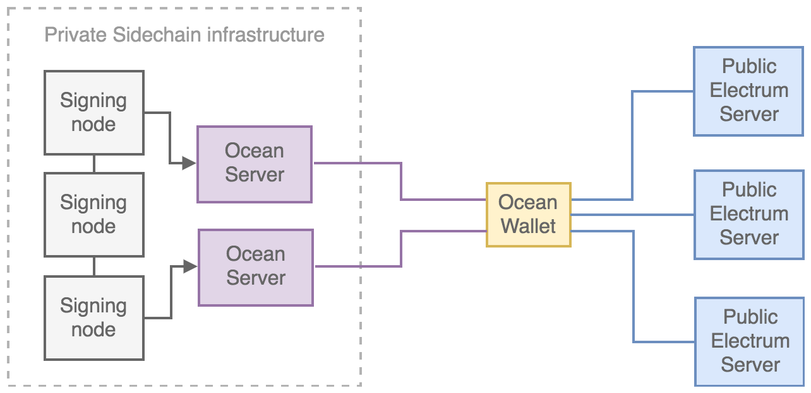

Ocean Wallet
=============

The Ocean Wallet is a lightweight wallet client that can hold assets on Ocean platform sidechains and which manages user private keys, token balances and registration/onboarding. It is built from the popular `Electrum <https://electrum.org>`_ Bitcoin wallet and incorporates all of Electrum's main features, including multisig functionality and hardware wallet integration. It is built entirely from Python, and uses PyQt libraries for the desktop GUI and Kivy libraries for the Android GUI. 

The Ocean Wallet performs independent verification of transaction confirmation in the sidechain (and on Bitcoin) using the Simple Payment Verification (SPV) protocol. SPV is a technique described
in Satoshi Nakamoto's whitepaper that allows a client to verify that a transaction is included in a blockchain, without downloading the entire blockchain. An SPV client only needs download the block
headers, which are much smaller than the full blocks. To verify that a transaction is in a block, a SPV wallet requests a proof of inclusion, in the form of a Merkle branch. This offers much more security than web wallets, because the wallet does not need to trust servers to confirm payments. 

In addition to client-side SPV transaction confirmation in the Ocean sidechain where an asset is issued and transacted, the Ocean Wallet also connects to the Bitcoin network (via Electrum servers) to trustlessly verify the unique single history of an Ocean sidechain against Bitcoin's global Proof-of-Work. With this option enabled, the Ocean Wallet also downloads the Bitcoin blockchain headers and independently verifies SPV proofs of the Mainstay commitments. 

The Ocean Wallet can be downloaded as Windows (``.exe``) or OSX (``.dmg``) binaries from the `Github releases page <https://github.com/commerceblock/ocean-wallet-build>`_. 

It can also be compiled from source or run in pure Python from the Ocean Wallet `Github repository <https://github.com/commerceblock/ocean-wallet>`_. 

Configuration
-------------

The Ocean Wallet is configured to connect to and verify specific Ocean sidechains, via a configuration file (``chain_config``) which is imported when the Ocean Wallet is first launched. This configuration file contains the genesis hash of the sidechain along with block verification scripts, Mainstay staychain verification pathways and Ocean Server connections. In addtion, the configuration contains asset and chain specific customisations, including fee rates, token untis, token names and mapping information. 

Wallet servers
--------------

The Ocean Wallet is confirgured to connect to Ocean Servers, which deliver the sidechain blockheaders and transaction confirmation proofs (SPV) via the `Stratum protocol <https://electrum.readthedocs.io/en/latest/protocol.html>`_. The Ocean Server is forked from the ElectrumX server used to operate the Electrum network, and is designed for high-performance and scaling, providing a large number of wallets with transactions, headers and proofs. The Ocean Server connects to an Ocean sidechain full node for a specific chain, and requires a separate chain-specific configuration (which requires the sidechain genesis hash and address formats). 

Ocean Servers (configured for a specific sidechain) must be run alongside Ocean platform nodes to run a wallet service. 
