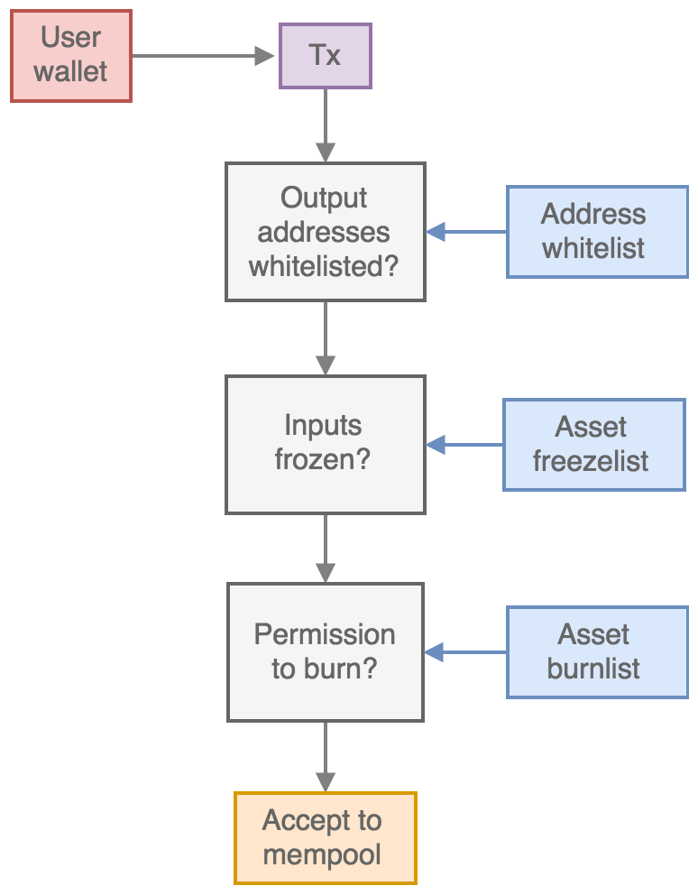
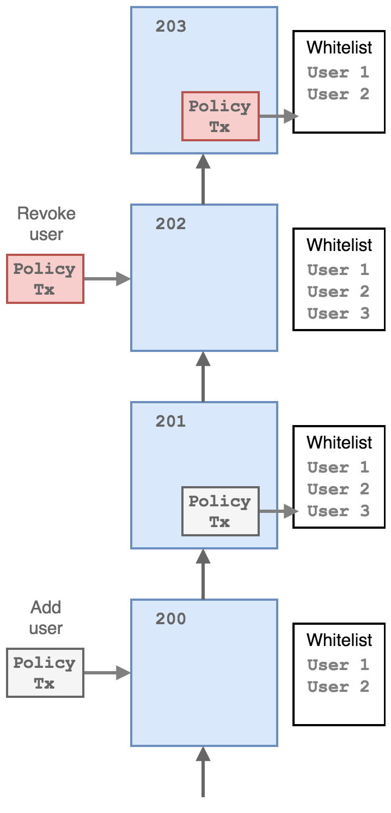
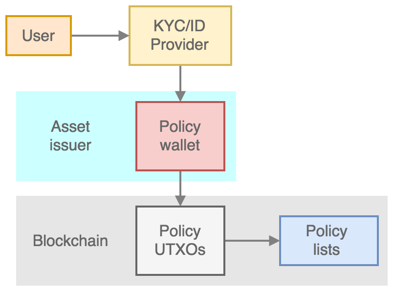

Permissions and Policy
-----------------------

Token issuance permissions
==========================

A principal function of Ocean sidechains is the support of multiple token types, with global token identity and state being enforced by client consensus rules. Tokens issued can represent ownership of any asset or security, are divisible to arbitrary precision, and can be transferred between user wallets with atomic operations. Any number of different token types can be issued on an Ocean blockchain, and any token type can be provably inflated (re-issued). The ability to issue new tokens or re-issue existing tokens on an Ocean blockchain can be restricted with custom permissions and security policies. An Ocean blockchain can be configured so that to issue or reissue any tokens requires multiple signatures from security officers (*controllers*) via a multisig script.

Permission to issue new tokens on an Ocean sidechain is controlled via the *issuance tokens* which is specified in the genesis block of particluar sidechain. The issuance token permissioned by a specified ``scriptPubKey`` given in the chain configuration as the ``issuancecoinsdestination``. 

Policy lists and transaction control
====================================

A core functionality of the Ocean platform is the ability of the sidechain operators (the asset issuers) to control and restrict the user transaction permissions, while issued token outputs remain *owned* (via the control of private keys in the user wallet) by the legal holder. This control can determine:

- Which user addresses (public keys) tokens can be paid to (the *whitelist*)
- Which user addresses tokens can be spent from (the *freezelist*)
- Which user addresses have permission to permanently destroy (burn) tokens (the *burnlist*)

These three *policy lists* then restrict which transactions that are generated and submitted by individual users can be added to new blocks generated by the block signing nodes, and therefore be allowed to transfer ownership of a tokenised asset peer-to-peer.

The policy lists are used by the block-signing nodes to determine which transactions are added to the *mempool*, and therefore in-turn added to new blocks. The restrictions are applied as follows:

1. The transaction is checked for any *spendable* outputs (i.e. P2PKH or P2SH). If *all* spendable output addresses are contained in the address whitelist, the transaction is accepted, if not it is rejected.
2. Each of the transaction inputs are checked - if *any* of the transaction input addresses are on the address freezelist, the transactions is rejected.
3. If any of the transactions outputs burn token value (i.e. send tokens to an ``OP_RETURN`` output) then *all* of the input addresses must be on the address burnlist.

Policy transactions
===================

The three policy lists (whitelist, freezelist and burnlist) are kept in the client memory, and are activated and applied as mempool policy if the configuration options ``-whitelist=1``, ``freezelist=1`` and ``-burnlist=1`` are set. The addresses in each policy list can be added, removed or queried via the client RPC interface. In addition, to enable scalable and modular deployment of federated nodes, the policy lists can also be controlled (i.e. addresses added and removed) via on-chain transactions: so-called *policy transactions*. This enables addresses to be added and removed from the policy lists by remote authorised agents outside of the signing nodes without any external connections except for the peer-to-peer protocol.

In this process, a special policy transaction containing an address to be added to a policy list is sent to the network (by an authorised wallet) and included in a block. Once confirmed, the address encoded in the policy transaction is added to the policy list by the block-signing nodes, and it is then enforced. A second policy transaction spending this previous output is then be used to remove the address from the list.

Policy tokens
=============

Permission to modify the policy lists via policy transactions is controlled via *policy tokens*. Policy tokens for the modification of each policy list are created in the genesis block under the control of a specified ``scriptPubKey``. These are specified in the configuration as ``whitelistcoinsdestination``, ``freezelistcoinsdestination`` and ``burnlistcoinsdestination`` respectively, and form part of the sidechain genesis block.

The wallets that control the private keys to these policy tokens then have the ability to modify the corresponding policy lists via policy transactions from outside of the federation signing nodes. These wallets can optionally be integrated directly with a KYC/ID service provider for onboarding new users of a sidechain or controlled manually by agents or staff of the asset issuer.

User onboarding
===============

The Ocean platform incorporates an *onboarding* protocol that is designed to streamline the adding of new users who have passed issuer-determiend KYC checks. This protocol allows users to self-register validated whitelist addresses in a way that preserves privacy on a publicly validated sidechain.

Preliminaries
^^^^^^^^^^^^^^

A shared deterministic wallet is generated and copied to a whitelisting node and the signing nodes. The private keys from the wallet are used for encrypting and decrypting whitelisting transactions as described below.

A WHITELIST asset is defined and created in the genesis block. This asset is initially assigned to an output owned by the wallet of the "whitelisting node". The whitelist asset is required for initial address whitelisting (user onboarding) and blacklisting transactions.

The asset issuer creates deterministic "wallet" key pairs ``pub_kyc`` (referred to as "KYC public keys") and ``priv_kyc`` and publishes the ``pub_kyc`` keys to the blockchain via a policy transaction using the WHITELIST asset as the asset type. The ``priv_kyc`` are known by the signing nodes and the whitelisting node, as they all share the same deterministic wallet.

Onboarding
^^^^^^^^^^^^^^

1. The user randomly selects a ``pub_kyc`` from the unassigned ``pub_kyc`` keys, generates a public private key pair (``pub_uob``, ``priv_uob``) and creates file containing ``pub_kyc`` and ``pub_uob``, tweaked address and corresponding untweaked public key data data for the addresses they want to register. The address data are encrypted using a shared secret generated from ``priv_uob`` and ``pub_kyc``. Therefore, the addresses can be read by the user, the signing nodes and the whitelisting node only. This "KYC file" is forwarded to the KYC vendor together with the user's ID details. The KYC file is generated from ``ocean`` client using the ``dumpkycfile`` command, or from the Ocean Wallet from the ``Wallet->Register`` menu item.
2. The KYC vendor forwards the result of the checks together with the KYC file data to a webhook.
3. If the user passed the KYC/AML checks then ``pub_kyc`` (or a newly assigned one if the original ``pub_kyc`` has been assigned to another user) is recorded in the blockchain together with the user's wallet addresses in a ``OP_REGISTERID`` transaction. Again, the WHITELIST asset is required.

On reading the transactions, the signing nodes and whitelisting nodes will build whitelisted address tables in RAM for fast lookup.

User address self-registration
^^^^^^^^^^^^^^^^^^^^^^^^^^^^^^^

Submission
~~~~~~~~~~

After the user's wallet has been onboarded, the user can register additional addresses to the whitelist.

The user submits a transaction that includes the following information:

* the tweaked address, encrypted with ``pub_c``
* The operation code (``OP_REGISTERADDRESS``)

Processing
~~~~~~~~~~

1. The signing node looks up the ``pub_c`` from the ``addr:pub_c`` map using the transactions input address (users will request new addresses using existing addresses).
2. If the ``pub_c`` is already whitelisted, the node decrypts ``addr_e``, adds it to the whitelist and updates the ``pub_c:addr`` map.

Node restart
^^^^^^^^^^^^^^

In case of node restart, the whitelist is rebuilt from the blockchain.

Privacy
^^^^^^^^^^^^^^

Access to the whitelisting wallet master key or a ``priv_kyc`` is required in order to link users to addresses.

Auditing
^^^^^^^^^^^^^^

Each user has their own pub/priv pair, so one user's addresses can be revealed if required by revealing their ``priv_kyc``, without revealing any other user's addresses.

